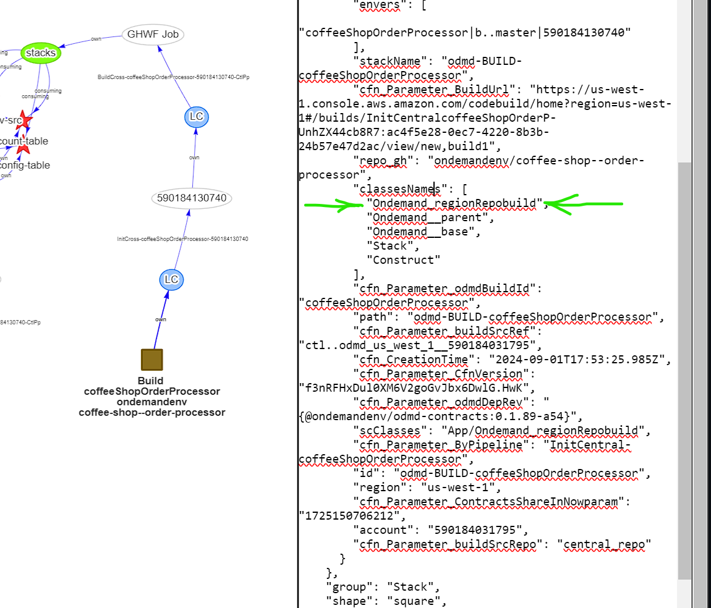
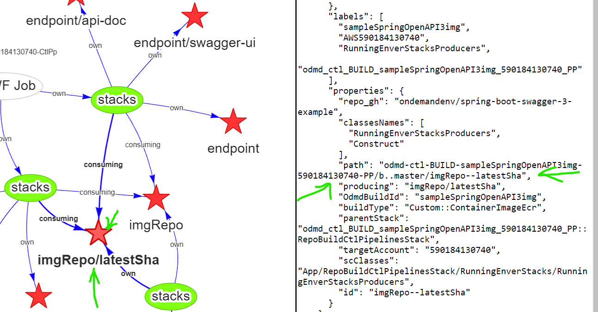
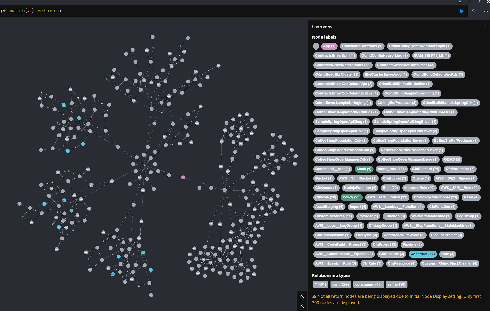
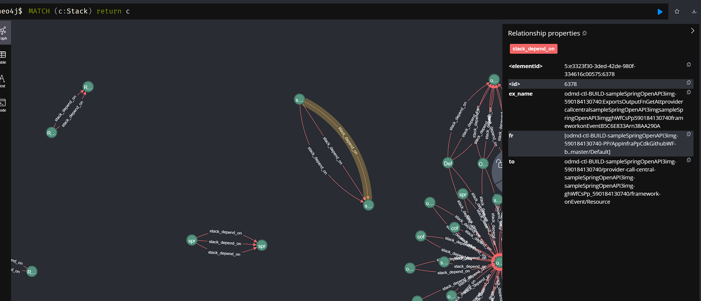
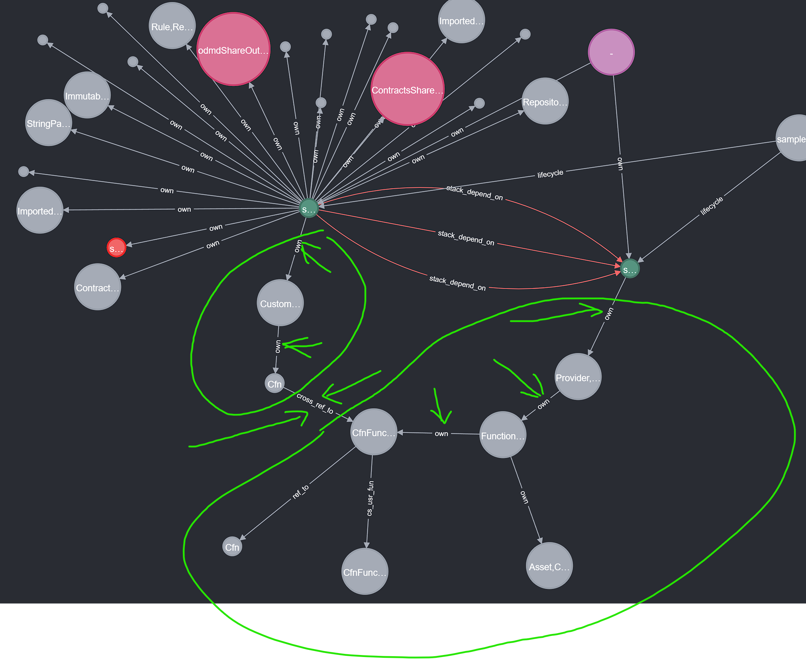

Odmd Viz GUI serverside source.

Odmd Viz GUI: http://vizuistack-bucket43879c71-hlpginonw2aa.s3-website-us-west-1.amazonaws.com/index.html


this repo shows the cypher QL are being used to match resources of selected buildIds:

```

MATCH     (root)
     -[l1]->(lc1:LifeCycle)-[r1:lifecycle]->(node1)
     -[l2]->(lc2:LifeCycle)-[r2:lifecycle]->(node2)
     -[l3]->(lc3:LifeCycle)-[r3:lifecycle]->(node3)
     -[l4]->(lc4:LifeCycle)-[r4:lifecycle]->(node4)
     -[l5]->(node5:EnverPipeline)
     -[l6]->(node6:RunningEnverStacksProducers)
     WHERE  "Ondemand__root" in root.classesNames and ( ${buildIds.map(bid => `node2.OdmdBuildId='${bid}'`).join(' or ')} )
     return  node2, node3, node4, node5, node6, l3,l4,l5,l6, lc3,lc4, r3,r4
```

VizGUI is still a prototype, it show 
1) lifecycle chain works for each app/service:
```
Ondemand_regionRepobuild -> OdmdStackLifeCycle -> Ondemand_regionRepobuildAccount -> OdmdStackLifeCycle -> RepoBuildCtlPipelinesStack -> RunningEnverStacks
```
all these classes can be found in 



2) how contracts producer and consumer works between different app/service, for example, below is how an ECR and container image are being used by another app/service:



VizGUI is still a prototype but it has great potential for developers:

The Neo4j  database contains information all resources of all stacks in the scope of a Contracts Lib, we can see everything thru native tool, the following snapshot only shows the 1st 300 nodes out of 1000, from the labels on the right, we can clearly see how these resources are organized by AWS CDK TS classes and actual deployements:




Can query any part/dimension for example how stacks depends on each other: 


Drill down to internal dependency chain:


So that we can see relationships inside and out across all resources in the whole system.